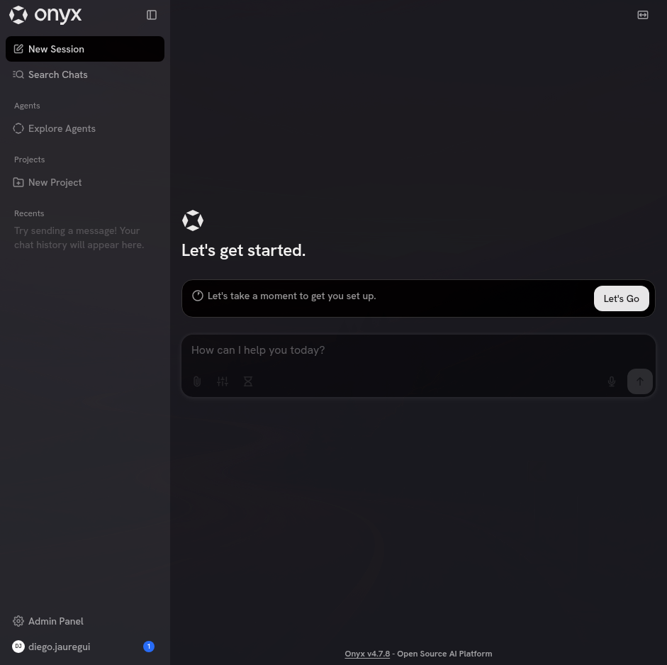

# Onyx

[Onyx](https://github.com/onyx-dot-app/onyx) is an open-source (MIT) search
engine over your own sources — repos, wikis, ticket trackers, chat, document
stores — with an LLM on top that answers questions citing the document it found.
It self-hosts completely: nothing you index leaves the VM.



The VM can run it. It is **off by default**, and for most uses it should stay
off.

## Whether you want it at all

An agent in this VM already reads your repositories well. It greps, follows
references and opens files, which on code beats similarity search — a reference
you wrote is better evidence than a chunk that scored nearby.

Onyx earns its place on everything that is **not** code and that nobody linked:
ticket history, runbooks, policy documents, years of chat. If your question is
"why did we decide this", and the answer is spread across a ticket, a thread and
somebody's memory, that is the case Onyx is for.

If you only want search over a folder of notes you wrote yourself, you do not
need this. Grep and a text editor will beat it until the notes number in the
hundreds.


## What it costs

Eleven containers: a web server, an API server, a background worker, OpenSearch,
Postgres, Redis, MinIO, plus two model servers for embeddings.

Measured on a 12 GB / 6 CPU VM, Omarchy 4.0.4, Onyx at `5094e0f`:

| | |
|---|---|
| Memory | **8 GB resident with nothing indexed**, leaving 3 GB free of 11. Below 11 GB the provisioner warns you |
| Disk | **~25 GB** for images and volumes before a single document is indexed. The stock 64 GB disk leaves 18 GB free — raise `disk_gb` |
| First start | Tens of minutes, dominated by the image pull |

Those are idle numbers. Indexing adds to both.

Running it is a decision to maintain a service — patching, backups, and, if you
index anything regulated, audit scope. Treat a trial as a trial.

## Turning it on

```json
{
  "memory_mb": 12288,
  "packages": ["docker", "docker-compose"],
  "onyx": {
    "enabled": true,
    "autostart": true,
    "port": 3000,
    "ref": ""
  }
}
```

| Key | |
|---|---|
| `enabled` | Provision Onyx at all |
| `autostart` | Bring the stack up at the end of provisioning. `false` installs it and leaves it stopped |
| `port` | Where the UI is served inside the VM. Default `3000` |
| `ref` | A git branch or tag to pin. Empty tracks the default branch |

`docker` and `docker-compose` must be in `packages`: the provisioner refuses to
guess and tells you to add them. It does enable the docker service and add your
user to the `docker` group, since Omarchy ships neither.

Then, inside the VM:

```bash
onyx-stack up      # also: down, ps, logs [service]
```

Open `http://localhost:3000`. The first account you create is the admin.

## Credentials stay out of the repo

Onyx needs **no LLM API key to boot**. The model provider, and every connector's
credentials, are entered in the web UI after it starts. None of it belongs in
`config.json`, and none of it should ever be committed.

`env.template` ships `POSTGRES_PASSWORD=password` and `minioadmin/minioadmin`.
The provisioner replaces those with 32-character random values the first time
and writes `.env` at mode 600. It never rewrites an existing `.env` — doing so
would leave the Postgres volume holding a password nothing knows any more.

## Do not use the lite overlay

`docker-compose.onyx-lite.yml` looks like the answer when 12 GB is more than you
have. It is not. It sets `DISABLE_VECTOR_DB=true` and moves the model servers,
OpenSearch, Redis and the background worker behind profiles, which **disables
connectors and search**. What is left is a chat window.

If Onyx does not fit in your VM, give the VM more memory or do not run Onyx.
There is no smaller version of the thing you actually wanted.

## Removing it

```bash
onyx-stack down
docker compose -f ~/Lab/onyx/deployment/docker_compose/docker-compose.yml down -v
rm -rf ~/Lab/onyx
```

`-v` drops the volumes, and with them everything indexed. Without it the data
survives for the next start.
